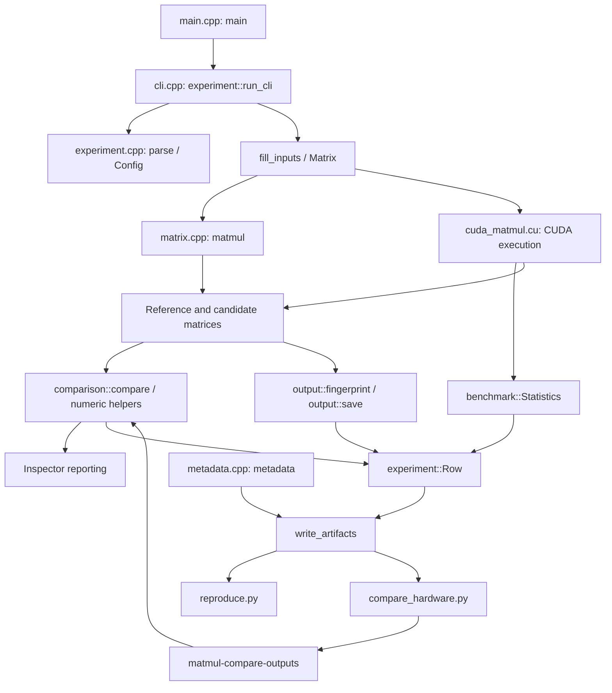

# Matmul Inspector: an end-to-end study guide

## Review basis and how to use this guide

This guide describes the repository reviewed at commit `b1173c1ba0d7da651c3b22756f5dc96ab5823c7b`, **“Add cross-hardware result comparison tooling.”** The working tree was clean when the review began. It is based on the implementation, tests, CMake configuration, scripts, documentation, and locally saved results—not on features proposed in earlier task descriptions.

The review did not run new benchmarks. It did inspect actual, Git-ignored RTX 4060 Ti and Tesla T4 captures under `results/cross-hardware/`, validate their 16 saved binary outputs against headers, lengths, and SHA-256 hashes, and directly compare the eight corresponding output payloads. All eight pairs were byte-identical. Those local captures are evidence for the examples below; they are not files a new clone is guaranteed to contain.

Read Sections 1–3 for orientation, Sections 4–8 for implementation detail, and Sections 9–11 for the current capabilities and development opportunities. Section 12 provides review questions without immediate answers. Section 13 is the compact mental model; the separate answer key is the final appendix.

## 1. Project purpose

Matmul Inspector investigates what happens when different implementations compute the same mathematical matrix product:

$$
C_{M \times N} = A_{M \times K} B_{K \times N},
\qquad
C_{ij} = \sum_{k=0}^{K-1} A_{ik} B_{kj}.
$$

The equation specifies real-number mathematics. It does not specify every floating-point rounding decision, instruction, memory access, or measurement boundary. Those details are the subject of this repository.

| Question | Current mechanism |
|---|---|
| Did two implementations produce exactly the same representations? | Bitwise comparison and output SHA-256 fingerprints |
| How far apart are differing results? | Absolute error, relative error, ULP distances, distributions, and first mismatches |
| Are differences acceptable under a chosen rule? | Combined absolute/relative tolerance |
| Does multiplication fuse with addition? | Explicit FMA and separate multiply/add CUDA variants, with PTX verification |
| Does changing association affect results? | Deterministic even/odd partial accumulation |
| Does shared memory improve this implementation? | Naive versus 16×16 tiled CUDA kernels and CUDA-event timing |
| Do different machines reproduce an output? | Saved matrices, replay, compatibility checks, and cross-hardware aggregation |
| Can someone identify how a result was produced? | Configuration, build, source, hardware, and software metadata |

Keep four separate ideas in mind:

1. **Bitwise agreement:** identical FP32 encodings.
2. **Numerical agreement:** passing the configured tolerance.
3. **Mathematical accuracy:** closeness to an exact or higher-accuracy answer.
4. **Performance:** elapsed time within a defined measurement boundary.

The repository directly measures the first two and kernel performance. Its CPU implementation and selected CUDA reference are comparison references, not exact mathematical oracles. Two implementations can agree on an inaccurate result. Conversely, a bitwise difference can pass tolerance. Even identical NaN encodings fail the project's numerical comparison rule.

### Current scope

The project contains a simple CPU matrix multiplication, five CUDA variants, numerical diagnostics, reproducible experiment capture, replay, and cross-hardware comparison tooling. It supports row strides at the matrix and execution API level.

It does **not** currently implement cuBLAS, Tensor Cores, mixed precision, compensated summation, a high-precision reference, roofline analysis, CPU/GPU crossover studies, automatic cloud execution, Python packaging, or binary wheel distribution. Later recommendations in this guide are proposals, not existing functionality.

## 2. Repository architecture

### Important files and responsibilities

Paths in this guide are relative to this document in `docs/`.

| Component | Files | Responsibility |
|---|---|---|
| Entry point | [src/main.cpp](../src/main.cpp) | Choose the original no-argument demonstration or the experiment CLI |
| CLI orchestration | [src/cli.cpp](../src/cli.cpp) | Execute configurations, select kernels, capture outputs, report results, handle status |
| Experiment model and serialization | [include/experiment.hpp](../include/experiment.hpp), [src/experiment.cpp](../src/experiment.cpp) | Parse configuration, generate inputs, describe variants, serialize artifacts |
| Environment provenance | [src/metadata.cpp](../src/metadata.cpp) | Gather source/build/runtime/host metadata |
| Matrix storage and CPU reference | [include/matrix.hpp](../include/matrix.hpp), [src/matrix.cpp](../src/matrix.cpp) | FP32 storage, dimensions, stride, indexing, CPU `matmul` |
| Scalar floating-point operations | [include/numeric.hpp](../include/numeric.hpp), [src/numeric.cpp](../src/numeric.cpp) | Bits, ULP ordering, errors, tolerance |
| Matrix comparison | [include/comparison.hpp](../include/comparison.hpp), [src/comparison.cpp](../src/comparison.cpp) | Aggregate diagnostics and bounded mismatch samples |
| Reporting and tracing | [include/inspector.hpp](../include/inspector.hpp), [src/inspector.cpp](../src/inspector.cpp) | Human-readable comparison and legacy memory/dot-product tracing |
| CUDA execution | [include/cuda_matmul.hpp](../include/cuda_matmul.hpp), [src/cuda_matmul.cu](../src/cuda_matmul.cu) | Kernels, device memory, launch/error handling, event timing |
| Timing statistics | [include/benchmark.hpp](../include/benchmark.hpp), [src/benchmark.cpp](../src/benchmark.cpp) | Mean, median, minimum, population standard deviation |
| Output fingerprint/storage | [include/output.hpp](../include/output.hpp), [src/output.cpp](../src/output.cpp) | SHA-256, portable binary output, binary reading |
| Native offline comparison | [src/compare_outputs.cpp](../src/compare_outputs.cpp) | `matmul-compare-outputs`: load two matrices and emit C++ diagnostics as JSON |
| Replay | [scripts/reproduce.py](../scripts/reproduce.py) | Reconstruct an executable invocation from metadata |
| Cross-hardware aggregation | [scripts/compare_hardware.py](../scripts/compare_hardware.py) | Match runs, check compatibility, validate outputs, produce combined reports |
| Instruction verification | [scripts/verify_fp.py](../scripts/verify_fp.py) | Inspect embedded PTX and record controlled arithmetic verification |
| Build and CI | [CMakeLists.txt](../CMakeLists.txt), [.github/workflows/ci.yml](../.github/workflows/ci.yml) | Optional CUDA, libraries/executables, provenance generation, tests, CI |
| Automated coverage | [tests/](../tests/) | C++ numerical/execution tests and Python artifact/replay/aggregation tests |
| Documentation and examples | [README.md](../README.md), [docs/](.), [results/examples/](../results/examples/) | Usage, experimental definitions, selected checked-in examples |

The existing layout is intentionally modest. Numerical, execution, reporting, and artifact responsibilities are separated by modules without forcing every module into a new directory.

### Data structures to recognize

- `Matrix`: physical FP32 storage plus logical dimensions and row stride.
- `experiment::Shape`: `m`, `n`, `k`.
- `experiment::Config`: mode, shapes, kernels, seeds, tolerances, measurement settings, output choices.
- `comparison::Divergence`: a coordinate and its reference/candidate values.
- `comparison::Result`: counts, errors, ULP statistics, first mismatches, and bounded samples.
- `benchmark::Statistics`: `mean_ms`, `median_ms`, `min_ms`, `stddev_ms`.
- `CudaKernelMeasurement`: output matrix and timing statistics.
- `experiment::Row`: one summary record joining shape, kernel, timing, comparison, hashes, and output paths.

### How the components connect



The new comparison path cleanly delegates arithmetic diagnostics to `numeric` and `comparison`. Some older Inspector methods still recompute host dot products for tracing; that is a remaining overlap discussed later.

## 3. CLI execution flow

### Entry point and the original demonstration

`main()` in `src/main.cpp` has two paths:

- With arguments, it forwards them to `experiment::run_cli`.
- Without arguments, it runs the original 2×3 by 3×2 demonstration. The CPU output is `[[58, 64], [139, 154]]`. If CUDA is available, it also computes and compares the default GPU result.

The no-argument demonstration is not the full experiment-capture workflow.

### Actual control-flow map

```text
src/main.cpp: main
  ↓ arguments supplied
src/cli.cpp: experiment::run_cli
  ↓
src/experiment.cpp: parse → Config
  ↓
metadata() + console Tee + create_run_directory(), when requested
  ↓
source-provenance warnings + CUDA availability + controlled-FP verification gate
  ↓ for each Config::shapes entry
Matrix A(M,K), B(K,N) → fill_inputs
  ↓
compare:   execute(reference), execute(candidate)
benchmark: benchmark_cuda_kernel(reference), benchmark_cuda_kernel(candidate)
  ↓
capture_pair → output::fingerprint; optionally output::save + JSON sidecars
  ↓
comparison::compare(reference, candidate, atol, rtol, max_mismatches)
  ↓
Inspector reporting or benchmark timing lines → experiment::Row records
  ↓
write_artifacts → summary.csv, optional mismatches.csv, console.txt, metadata.json
```

Validation occurs at several stages, not just after execution. In particular, hashing, matrix comparison, and serialization happen outside CUDA-event timing.

### Parsing and defaults

`experiment::parse` parses a vector of arguments into `Config`. The supported workflow names are `compare` and `benchmark`; a legacy `--benchmark-cuda` path remains.

| Setting | Current default or rule |
|---|---|
| Compare sizes | `4` |
| Benchmark sizes | `4,256,257,1024` |
| Reference / candidate | `naive` / `tiled` |
| Seed A | `42` |
| Seed B | `123` by default; derived as A seed + 81 when not explicitly supplied |
| Warmups / iterations | `3` / `20` |
| Absolute / relative tolerance | `1e-6` / `1e-5` |
| Input | `random` |
| Maximum stored mismatch samples | `100` |
| Save matrices | Off |

The historical 50-iteration captures are explicit configurations; 50 is not the current `Config` default.

Square shapes use `--sizes`; a rectangular shape uses all of `--m`, `--n`, and `--k`. The parser rejects mixing those forms, duplicate flags, unknown kernels, nonpositive dimensions, invalid counts, and nonfinite or negative tolerances. Benchmark mode requires CUDA kernels; `cpu` is available in compare mode. Warmup/iteration options belong to benchmark mode. `--save-output` requires an output directory. The mismatch sample cap is bounded to 0–1000.

Available kernel names are:

```text
cpu
naive
tiled
cuda-naive-fma
cuda-naive-no-fma
cuda-naive-reordered
```

Examples:

```bash
./build/matmul-inspector compare \
  --reference cpu --candidate cpu --sizes 4 --seed 42

./build-cuda/matmul-inspector compare \
  --reference cuda-naive-fma --candidate cuda-naive-no-fma \
  --sizes 4,256,257,1024 --seed 42 --output results/fma-comparison

./build-cuda/matmul-inspector benchmark \
  --reference naive --candidate tiled --sizes 4,256,257,1024 \
  --seed 42 --warmups 3 --iterations 50 \
  --save-output --output results/naive-vs-tiled
```

Each output directory must be new. The program refuses to overwrite even an existing empty run directory.

### Deterministic matrix generation

`fill` uses a local 32-bit linear congruential generator, not global random state:

```cpp
seed = 1664525u * seed + 1013904223u;
```

The generated logical element is derived from:

```cpp
float(int((seed >> 16) % 101) - 50) / 100.0f
```

Unsigned arithmetic supplies defined wraparound. The upper bits select one of 101 discrete values between −0.5 and +0.5. Elements are generated in logical row-major order. A and B have separate seeds, and generation restarts for each shape. For example, seed 42 produces a first value of `0.24f`.

The generator identifier `lcg32-v1` matters: recording a seed without recording the generating procedure is insufficient for reproducibility. Shape, A/B seeds, input fixture, and dtype also matter.

`fill_inputs` additionally supports sensitive fixtures:

- **Cancellation fixture:** A repeats `[2^24, 1, -2^24, 1]`; B contains ones. The small contributions can disappear depending on accumulation association. This fixture requires K ≥ 4.
- **FMA-sensitive fixture:** A begins `[-1, 1 + 2^-23]`; B's corresponding terms begin `[1, 1 - 2^-23]`. Remaining A terms are zero. The exact second product differs slightly from one, exposing product rounding versus fused multiply-add. This fixture requires K ≥ 2.

Fixture generation is deterministic and versioned. The fixture values do not depend on the recorded random seeds.

### Compare versus benchmark

`execute` dispatches `cpu` to `matmul`; CUDA names map through `cuda_kernel` to `CudaMatmulKernel` and `cuda_matmul`.

Compare mode executes each selected implementation once and emphasizes diagnostics. Benchmark mode measures the reference kernel and then the candidate kernel with `benchmark_cuda_kernel`. It compares the returned output matrices afterward. It does not place comparison instrumentation inside each measured launch.

`capture_pair` fingerprints both matrices and optionally writes them. An `experiment::Row` joins numerical results with output identifiers. Compare mode writes one candidate summary row per shape. Benchmark mode writes reference and candidate rows; the reference row is a self-comparison with speedup 1.

### Validation and exit status

| Layer | Examples of checks |
|---|---|
| CLI parser | Supported options, kernels, dimensions, count/tolerance constraints |
| Matrix construction | Row stride ≥ columns; storage-size overflow |
| CPU/CUDA execution | Compatible inner dimensions; device/grid/storage limits |
| CUDA wrapper | Runtime availability, API return codes, launch errors, synchronization |
| Comparison | Matching output dimensions; valid tolerances |
| Binary reader/aggregator | Format, dimensions, file length, hash, sidecar context, experiment compatibility |

The CLI uses success `0`, execution/tolerance failure `1`, argument error `2`, and CUDA-unavailable skip `77`. The legacy benchmark invocation retains a successful skip convention. A normal comparison can therefore finish computation and still return failure because numerical tolerance failed.

## 4. Matrix layout and CUDA kernels

### Matrix storage is part of execution semantics

A `Matrix` stores logical rows and columns separately from `row_stride()`. The stride is measured in **floats**, not bytes.

For a 2×3 matrix with row stride 5:

```text
physical index:  0    1    2    3    4    5    6    7    8    9
storage:        a00  a01  a02  pad  pad  a10  a11  a12  pad  pad
```

`Matrix::operator()(row, col)` accesses:

```cpp
data_[row * row_stride_ + col]
```

Thus `(1,2)` is physical index 7, not 5. Indexing is unchecked; callers must establish valid dimensions and coordinates. Storage has `rows * row_stride` elements and begins zero-initialized. The default stride equals the number of columns.

CPU and CUDA implementations use logical dimensions for mathematical loops and strides for addressing. GPU allocations/copies include physical row padding. Hashes and binary artifacts include only logical values. Inspector memory dumps visit logical elements while showing their actual addresses.

The APIs support strided inputs and an optional output stride. The experiment CLI constructs contiguous matrices; it does not currently expose every layout choice through flags.

### Kernel inventory

| CLI name | Implementation | Intended variable |
|---|---|---|
| `naive` | `matmul_kernel` | Simple sequential-K baseline with compiler-default contraction |
| `tiled` | `tiled_matmul_kernel` | Shared-memory reuse with increasing-K accumulation |
| `cuda-naive-fma` | `mi_naive_fma` → `controlled_matmul<true, false>` | Explicit FP32 fused multiply-add |
| `cuda-naive-no-fma` | `mi_naive_no_fma` → `controlled_matmul<false, false>` | Explicit separately rounded multiply and add |
| `cuda-naive-reordered` | `mi_naive_reordered` → `controlled_matmul<true, true>` | Explicit FMA with deterministic even/odd association |

There are no additional optimized matmul algorithms hidden behind these names.

### Naive CUDA kernel

A block has 256 threads. Each thread owns one flattened output index, then maps it to a row and column. The relevant indexing can be read as:

```cpp
index = blockIdx.x * blockDim.x + threadIdx.x;
row = index / cols;
col = index % cols;
```

1. The block and thread indices identify one global logical output position.
2. Division identifies the output row.
3. Remainder identifies the output column.
4. An index guard prevents excess threads from writing beyond M×N.

Each active thread initializes an FP32 accumulator to zero and visits K in increasing order. Its accesses are equivalent to:

```text
A[row * a_stride + k]
B[k * b_stride + col]
C[row * c_stride + col]
```

The implementation is easy to relate to the mathematical dot product. Each thread repeatedly reads global-memory operands; there is no explicit block-level reuse.

Do not confuse one thread's access trajectory with coalescing across threads. A single thread walks down a B column. Neighboring output-column threads access neighboring B elements for the same k, which can be coalesced. Cache behavior and hardware reuse also matter, even in a “naive” kernel.

### Tiled shared-memory kernel

The tile size is the constant 16. Blocks contain 16×16 threads. The grid covers output columns and rows using ceiling division.

Two shared arrays hold 16×16 FP32 values each: **2,048 bytes total** for the operand tiles. A block repeats:

1. Load one A and one B element per thread into shared memory.
2. Substitute zero for out-of-range loads.
3. Call `__syncthreads()` so all tile data is visible.
4. Accumulate products from shared memory in increasing K order.
5. Call `__syncthreads()` before any thread overwrites the shared arrays for the next tile.

Threads whose output coordinates are outside the matrix still participate in the barriers. Only the final output write is guarded. Returning early before block-wide barriers would be unsafe.

An important detail of the current implementation is that its inner loop checks both tile bounds and the true K bound. It does **not** deliberately add extra zero products beyond the logical inner dimension. At K = 257, the seventeenth tile contributes one valid product per output.

This kernel exists to investigate data reuse while preserving valid-product accumulation order. It changes memory organization and scheduling; it does not intentionally introduce a different reduction association. Similar order does not justify assuming bitwise equality—results are measured.

### Explicit FMA and no-FMA variants

`controlled_madd<Fused>` makes the arithmetic distinction explicit:

```cpp
if constexpr (Fused) {
    return __fmaf_rn(a, b, sum);
} else {
    return __fadd_rn(__fmul_rn(a, b), sum);
}
```

- `__fmaf_rn` computes the product-plus-sum with one round-to-nearest FP32 rounding.
- `__fmul_rn` rounds the product to FP32 first.
- `__fadd_rn` then rounds the separate addition.
- `if constexpr` selects the implementation at compile time.

Both sequential variants use the same thread ownership, inputs, layout, and increasing-K order. No global fast-math switch is required. These explicit CUDA intrinsics provide a narrower experiment than changing unrelated compiler settings across the whole program.

The default `naive` name means compiler-default arithmetic, whereas `cuda-naive-fma` means explicitly requested fused arithmetic. They can produce the same code or results, but they describe different guarantees.

### Reordered accumulation

The reordered variant maintains two private FP32 accumulators:

```text
sum_even accumulates k = 0, 2, 4, ...
sum_odd  accumulates k = 1, 3, 5, ...
result = explicitly rounded addition(sum_even, sum_odd)
```

Products accumulate through explicit FMA; the final combination uses `__fadd_rn`. An odd K is handled by guarding the last odd term. One thread still owns each output, so there are no cross-thread reductions, atomics, races, or nondeterministic scheduling dependencies in accumulation.

The clean association experiment compares `cuda-naive-fma` against `cuda-naive-reordered`: fusion stays explicit in both, and association changes. Comparing no-FMA against reordered would change two factors at once.

### How arithmetic intent is verified

`scripts/verify_fp.py` inspects PTX extracted with `cuobjdump`. It locates the controlled entry points and checks their FP32 arithmetic instructions. The checks require FMA in the fused variants and separate multiply/add without FMA in the no-FMA variant; missing entry points, unexpected calls, or ambiguous arithmetic are rejected rather than silently certified.

The verification is tied to a SHA-256 of the CUDA library and feeds generated build metadata. An unverified build can still support ordinary kernels, but the CLI blocks controlled variants when their required verification is absent.

Previously captured inspection output showed fused arithmetic in the FMA variant and separate multiply/add in the no-FMA variant. Exact instruction counts may vary with compiler unrolling, so the purpose is to check the intended distinction, not require a universal instruction count.

The guarantee is about **embedded PTX inspected for that build**. It is not an exhaustive audit of every final machine-code path produced by driver JIT compilation on every GPU. PTX and final SASS are distinct levels.

## 5. Floating-point analysis

### Exact representations

`numeric::float_to_bits` copies a float into `uint32_t` using `memcpy`. This examines the representation without violating aliasing rules. `float_bits` wraps those bits in `std::bitset<32>`; `bitwise_equal` compares the integers.

For example:

```text
+0.0f = 0x00000000
-0.0f = 0x80000000
```

They compare equal numerically but not bitwise. Inspector comparison reports show binary representations; the legacy detailed trace also exposes hexadecimal representations and operand addresses.

### Absolute and relative error

The helpers use FP32 arithmetic:

\[
\text{absolute error}=|\text{candidate}-\text{reference}|.
\]

For a nonzero reference:

\[
\text{relative error}=\frac{|\text{candidate}-\text{reference}|}{|\text{reference}|}.
\]

For a zero reference, the current `relative_error` helper returns **zero**. That is a preserved reporting convention, not evidence that a nonzero candidate is correct. Absolute error, tolerance failure, and `zero_reference_nonzero` expose that situation.

The aggregate stores errors as doubles, but the underlying helper arithmetic happens in FP32 first. Subtraction of sufficiently large opposite-sign finite values can overflow; converting the result to double afterward cannot recover the lost range.

### The tolerance rule

`comparison_tolerance` and `nearly_equal` implement:

\[
|a-b|\leq\max(\mathrm{atol},\mathrm{rtol}\max(|a|,|b|)).
\]

This is a maximum of absolute and relative terms—not `atol + rtol * scale`. The scale is symmetric in the two operands even though the separately reported relative error uses the reference denominator.

Special handling comes before the finite comparison:

- Any NaN makes `nearly_equal` false.
- Exact numerical equality makes it true, including signed zeros and same-sign equal infinities.
- Other nonfinite pairs fail.

A small absolute tolerance provides a meaningful allowance around zero, where a relative rule alone would be unstable or overly strict.

### ULP distance and negative values

Raw IEEE-754 encodings are not directly ordered by numerical value across signs. `float_to_ordered` constructs a monotonic integer key:

```cpp
if (bits & 0x80000000u) {
    return ~bits;
}
return bits | 0x80000000u;
```

Negative encodings are complemented; nonnegative encodings receive the high bit. `ulp_distance` subtracts ordered keys after its special cases:

- NaN returns `UINT32_MAX`, a sentinel.
- Numerical equality returns zero, including +0 versus −0.
- Otherwise, the distance is the unsigned difference between keys.

Adjacent positive floats have distance 1. Adjacent negative floats also have distance 1. Identical floats have distance 0.

One subtle convention is worth remembering: the ordered mapping contains distinct signed-zero keys even though equality overrides their mutual distance. Consequently, the smallest negative subnormal to the smallest positive subnormal has mapped distance **3**. Do not assume every other ULP library uses precisely this convention.

A large ULP distance near zero can accompany a tiny absolute error because representable spacing there is extremely small.

### Aggregate diagnostics

`comparison::compare` scans logical output elements in row-major order. It records:

- Total output count.
- Bitwise-divergent count and percentage.
- Tolerance-failure count and percentage.
- First bitwise divergence and first numerical failure separately.
- Maximum ULP distance.
- Mean ULP distance among **bitwise-divergent finite pairs**.
- Maximum absolute and relative errors among finite pairs.
- Counts of finite, NaN-containing, infinity-containing, and zero-reference/nonzero-candidate pairs.
- Bounded mismatch samples and a truncation flag.

The ULP bins for bitwise-divergent finite pairs are:

```text
0, 1, 2, 3–4, 5–8, >8
```

The zero bin captures signed-zero differences. Nonfinite pairs do not enter the finite ULP/error aggregate population. They still affect appropriate bitwise and tolerance counts.

The sample list contains pairs that diverge bitwise **or** fail tolerance. This matters for identical NaN encodings: they can fail tolerance without being bitwise divergent. Setting the sample cap to zero preserves aggregate counts and first mismatches while suppressing stored sample rows.

### Output fingerprints

`output::fingerprint` hashes the exact logical FP32 representations using the project's SHA-256 implementation:

1. Visit logical elements in row-major order.
2. Copy each representation without floating-point arithmetic.
3. Feed its four bytes in little-endian order into SHA-256.
4. Return a 64-character hexadecimal digest.

Padding, host endianness, binary headers, and matrix dimensions do not enter the hash. Signed-zero differences and NaN payload bits do. Dimensions and experiment context must therefore be validated separately.

Equal hashes are the practical cryptographic fingerprint test for equal logical byte streams; hash equality is not a mathematical proof against collisions. When full outputs are available, the native comparator can perform direct numerical/bitwise inspection. Hashing complements that comparison rather than replacing it.

## 6. Benchmark methodology

### The measurement boundary

`benchmark_cuda_kernel` calls the shared `run_matmul` implementation. The wrapper manages device allocations with `DeviceBuffer` and CUDA events with `CudaEvent`. CUDA calls and launches are checked; cleanup errors are handled without masking an earlier exception.

Before measurement, the wrapper:

1. Validates dimensions, storage sizes, and launch geometry.
2. Allocates device buffers.
3. Copies A and B, including their physical padding.
4. Initializes output storage.
5. Launches the requested warmups.
6. Synchronizes before measurement.

Each measured iteration has the following shape:

```text
record start event
launch selected kernel
record stop event
synchronize stop event
read CUDA-event elapsed milliseconds
append sample
```

CUDA launches are asynchronous. A host timer around a launch alone would usually measure submission behavior rather than completed GPU execution. Event timing brackets work in the CUDA stream, and synchronizing the stop event ensures the measurement is ready.

Allocation, transfers, warmups, output comparison, hashing, serialization, and cleanup are excluded from reported kernel milliseconds. The final device-to-host copy occurs after execution and synchronization. This is not end-to-end application latency.

Tiny kernels still show launch/scheduling effects and measurement noise. “Kernel-only” does not mean a tiny measurement equals only the arithmetic instruction cost.

### Statistics

`benchmark::Statistics` contains:

- Arithmetic mean.
- Median from a sorted copy of the samples.
- Minimum.
- Population standard deviation, using denominator n rather than n−1.

\[
\bar t=\frac{1}{n}\sum_i t_i,\qquad
\sigma=\sqrt{\frac{1}{n}\sum_i(t_i-\bar t)^2}.
\]

The code rejects invalid samples. It does not currently persist every raw timing sample, so artifacts cannot reconstruct a full latency histogram afterward.

The reference's measured iterations run before the candidate's. This is straightforward but does not randomize thermal, clock, or background-load drift between kernels.

### Operation counts and throughput

Reported throughput uses the conventional matrix multiplication count:

\[
\mathrm{FLOPs}=2MNK,
\qquad
\mathrm{GFLOP/s}=\frac{2MNK}{t_{\mathrm{ms}}\times10^6}.
\]

For 1024³, the nominal count is 2,147,483,648 floating-point operations. An FMA counts as two mathematical operations under this convention. The reordered kernel's extra final combination does not change the common nominal count used for comparison.

The artifacts report GFLOP/s. TFLOP/s can be derived by dividing by 1000; it is not a separate analysis implemented here.

For square matrices, nominal arithmetic grows as N³ while logical input/output storage grows as N². Doubling N gives eight times the nominal work, but measured latency need not scale by exactly eight because utilization, caches, scheduling, and other effects change.

The standard sizes have useful roles:

| Size | Why it is included |
|---|---|
| 4 | Small inspectable result; overhead dominates timing |
| 256 | Tile-aligned moderate case |
| 257 | Partial tiles and boundary handling |
| 1024 | Larger performance case |

Within an experiment, `speedup` is reference mean divided by candidate mean. Its meaning depends on the selected reference; it is not automatically “versus naive” for every possible CLI invocation.

## 7. Cross-hardware comparison

### Saving portable output matrices

`--save-output` creates binary matrices and adjacent JSON sidecars. `output::save` uses this format:

| Byte offset | Size | Meaning |
|---:|---:|---|
| 0 | 8 | ASCII magic `MIFP32LE` |
| 8 | 8 | Unsigned little-endian row count |
| 16 | 8 | Unsigned little-endian column count |
| 24 | 4 × rows × columns | Logical FP32 representations, little-endian, row-major |

There is no row padding and no permitted trailing payload. `output::read` validates the magic, dimensions/storage limits, and expected file size, then reconstructs a contiguous Matrix.

The adjacent `.bin.json` sidecar records format, dtype, byte order, output dimensions, M/N/K, kernel, both seeds, generator, contraction and accumulation modes, and SHA-256. This supplies experiment context that the minimal binary header does not carry.

### Native comparison of saved outputs

The executable built from `src/compare_outputs.cpp` is:

```bash
./build/matmul-compare-outputs REFERENCE.bin CANDIDATE.bin ATOL RTOL
```

It reads both matrices, calls `comparison::compare`, and emits JSON with `diagnostics_version`, aggregate metrics, ULP bins, and first divergences. It uses the same C++ semantics as live comparisons. It returns success for a valid comparison even when values differ; invalid invocation or input is an error.

The helper itself does not validate the sidecar's seed or kernel identity. The Python aggregator performs that contextual validation before invoking it. Nonfinite numbers are represented explicitly as JSON strings where necessary.

### Matching runs and checking compatibility

`scripts/compare_hardware.py` uses Python's standard library. `read_run` reads metadata and summary rows, and validates supported schemas, status, required fields, shapes, timing values, hashes, and duplicate configurations.

Rows are matched with:

```python
(kernel, M, N, K)
```

A different shape is a separate configuration, not a numerical mismatch. Matching keys alone are insufficient: `compatibility` checks the input and semantic context.

| Difference | Current treatment |
|---|---|
| Seed, B seed, dtype, generator, or input fixture | Blocks direct output comparison |
| Tile/contraction/accumulation semantics | Blocks direct output comparison when incompatible |
| Shape or kernel has no baseline row | Separate/no-baseline configuration |
| Compiler, runtime, driver, architecture flags | Allowed as cross-toolchain variation, but flagged |
| Dirty/unknown/mismatched source provenance | Marks the comparison uncontrolled and blocks controlled performance ratios |
| Build type or timing methodology mismatch/unknown | Blocks controlled performance ratios |
| Warmups, iterations, workflow and other controlled configuration differences | Flagged and can block performance ratios |
| Tolerance difference | Flagged; detailed cross-run diagnostics use baseline tolerances |

Numerical observations can still be useful across source differences, but they are labeled rather than presented as a controlled same-source experiment.

`binary` validates saved output paths, rejects paths escaping the run directory, cross-checks sidecars, validates binary headers and sizes, and recomputes payload hashes.

### Hash and detailed-comparison decisions

The tool distinguishes situations rather than inventing missing metrics:

- Compatible equal hashes: bitwise-identical output fingerprint.
- Different hashes with both binaries and the native helper: detailed C++ numerical comparison.
- Different hashes without sufficient output/helper data: hashes differ, detailed diagnostics unavailable.
- Missing hashes: only the available performance/environment comparison can be reported.
- Incompatible inputs: no direct bitwise result claim.

When binaries and a helper are present, detailed comparison can also run for equal hashes. That matters for NaNs: equal representations do not imply numerical tolerance passes.

### CLI and aggregate artifacts

```bash
python3 scripts/compare_hardware.py \
  --baseline results/cross-hardware/rtx4060ti \
  --comparator build/matmul-compare-outputs \
  --output results/cross-hardware/4060ti-vs-t4-new \
  results/cross-hardware/rtx4060ti \
  results/cross-hardware/tesla-t4
```

If no baseline is supplied, the first input directory is used and reported. No “best hardware” is selected. The output directory must not already exist.

Outputs are:

- `cross_hardware_summary.csv`: hardware/software identity, configuration, timing, throughput, and ratios.
- `cross_hardware_numerics.csv`: compatibility, hashes, and numerical diagnostics relative to baseline.
- `cross_hardware_metadata.json`: source-run provenance, baseline selection, source metadata/summary digests, and aggregator/comparator identity.

A hardware label comes from captured GPU name and compute capability, with environment fields such as CPU/compiler recorded separately. Directory names and usernames are not canonical hardware identities.

Two ratios are intentionally separate:

\[
\text{within-machine naive speedup}=\frac{t_{\text{naive on this machine}}}{t_{\text{kernel on this machine}}}
\]

\[
\text{baseline performance ratio}=\frac{t_{\text{baseline machine, same kernel}}}{t_{\text{candidate machine, same kernel}}}.
\]

For the second ratio, a value above one means the candidate machine completed that configuration faster than the baseline.

### Actual RTX 4060 Ti → Tesla T4 example

The local captures inspected during this review have:

| Field | RTX capture | T4 capture |
|---|---|---|
| GPU | NVIDIA GeForce RTX 4060 Ti | Tesla T4 |
| Compute capability | 8.9 | 7.5 |
| CPU | AMD Ryzen 7 7700X | Intel Xeon, reported at 2 GHz |
| CUDA compiler | 13.3.73 | 12.8.93 |
| CUDA runtime version field | 13030 | 12080 |
| NVIDIA driver | 616.92 | 580.82.07 |
| Captured CUDA architecture setting | 75 | 52 |
| C++ compiler version | GNU 13.3.0 | GNU 13.3.0 |
| Source | Clean `b1173c1` | Clean `b1173c1` |

The architecture build setting and the GPU's compute capability are different concepts. Their differing values also show why a result cannot be understood from the GPU marketing name alone.

Both captures selected reference `naive` and candidate `cuda-naive-fma`, shapes 4, 256, 257, and 1024, seed 42/B seed 123, the random generator, three warmups, 50 measured iterations, Release builds, tolerances 1e−6/1e−5, and saved outputs.

The workflow was structurally:

```text
RTX run → metadata/summary/output binaries
    ↓ metadata replay on a separately built T4 environment
T4 run → metadata/summary/output binaries
    ↓ collect both result directories
compare_hardware.py: read_run → key → compatibility → binary/hash validation
    ↓ native matmul-compare-outputs
cross-hardware CSV/JSON reports
```

All eight corresponding output configurations—two kernels times four sizes—were byte-identical in the inspected captures. Their detailed comparisons reported zero divergent elements, zero ULP/error aggregates, zero tolerance failures, and no first divergence. Within each shape, the naive and explicit-FMA outputs also had the same fingerprints.

For the explicit-FMA kernel, the stored measurements are:

| Square size | RTX mean ms | T4 mean ms | T4 baseline performance ratio, RTX baseline |
|---:|---:|---:|---:|
| 4 | 0.005114 | 0.006122 | 0.8354 |
| 256 | 0.035491 | 0.096131 | 0.3692 |
| 257 | 0.037679 | 0.118891 | 0.3169 |
| 1024 | 2.360435 | 4.319997 | 0.5464 |

On the T4 itself, the stored 1024 naive mean was 5.043223 ms versus 4.319997 ms for explicit FMA: approximately 1.1674× within-machine speedup. That is a different comparison from the cross-machine ratio.

These are hardware/software-specific historical measurements, not freshly generated benchmarks or universal performance claims. The aggregator flags the compiler/runtime/driver/build-target differences as cross-toolchain variation. The data does not isolate GPU architecture as the sole cause of a latency difference, and it does not establish cross-hardware behavior for tiled, no-FMA, or reordered kernels.

## 8. Reproducibility and artifacts

### Per-run artifacts

The current writer emits schema version 3. Replay and aggregation retain support for versions 1 and 2 where their available fields permit it.

| Artifact | Contents and purpose |
|---|---|
| `metadata.json` | Configuration, source/build/environment provenance, arithmetic modes/verification, run status; the main replay input |
| `summary.csv` | One candidate row per compare shape, or reference/candidate rows per benchmark shape; timings, aggregates, modes, hashes, output paths |
| `console.txt` | Captured human-readable output for reviewing what the executable reported |
| `mismatches.csv` | Bounded sampled divergences/failures with coordinates, values, bits, errors, and tolerance information; omitted if no samples are stored |
| `output-…-reference.bin`, `output-…-candidate.bin` | Optional exact logical output representations |
| Adjacent `.bin.json` files | Context and hash for each binary matrix |
| Build FP verification report/header | Evidence used to label controlled arithmetic as verified; reflected in run metadata |

`mismatches.csv` is not necessarily an exhaustive list. Read the sample cap and truncation flag. A cap of zero can suppress the file even when aggregate diagnostics report failures.

Text artifacts use temporary files followed by rename, and metadata is written last as a completion/status marker. The entire run directory is not one atomic transaction: binary outputs are written earlier, and a crash can leave partial artifacts.

Statuses distinguish completion, tolerance failure, skipped execution, and execution failure. The aggregator accepts completed and tolerance-failed experiments; a numerical failure is still a useful completed observation.

### Provenance capture

CMake-generated information records the build context, while `metadata()` attempts runtime source/environment probes. Captured fields include commit and dirty state, build type, compiler identities and flags, CUDA architecture settings, CUDA/runtime/driver information, GPU name and compute capability, CPU model, OS, timestamp, and verification state.

Build-time dirty state and runtime dirty state both matter. A clean working tree today cannot make a binary compiled from dirty sources reproducible retroactively. Runtime source probing also depends on whether the original source path remains available.

Unknown optional metadata is represented explicitly rather than preventing useful execution. Fast-math reporting partly depends on compiler macros and flag inspection; raw captured flags remain important evidence.

### Replay

```bash
python3 scripts/reproduce.py \
  results/cross-hardware/rtx4060ti/metadata.json \
  --executable build-cuda/matmul-inspector \
  --output results/cross-hardware/new-machine
```

`reproduce.py` reconstructs shapes, reference/candidate names, seeds, fixtures, tolerances, sample limits, benchmark counts, and the saved-output choice. `--dry-run` shows the command without executing it.

Replay uses an already-built executable. It does not check out source, restore dirty modifications, install a compiler, reconstruct hardware, or force the original thermal/load state. A reproducible workflow therefore has two stages:

1. Obtain and build the intended source with a recorded environment.
2. Replay the recorded experiment configuration and compare the new environment metadata.

For a cross-hardware experiment, GPU/CPU, driver, runtime, and possibly compiler are expected independent variables. Inputs, shape, kernel semantics, source identity, and measurement policy should remain controlled or be explicitly flagged.

## 9. Current technical accomplishments

| Area | What the project can demonstrate now |
|---|---|
| Correctness and numerical analysis | Strided FP32 matrix execution; exact and tolerance comparisons; first and aggregate diagnostics; signed-zero/nonfinite conventions; portable output fingerprints |
| CUDA experimentation | Global-memory baseline, shared-memory tiling, verified explicit fusion versus separate operations, deterministic accumulation reordering |
| Benchmarking | Kernel-only CUDA-event measurement after warmups, four latency statistics, nominal GFLOP/s, reference-relative speedup |
| Cross-hardware analysis | Baseline selection, configuration compatibility, environment-aware reporting, hash comparison, native detailed matrix comparison |
| Reproducibility | Deterministic/versioned inputs, configuration and provenance artifacts, optional output matrices, replay, compiler-instruction evidence |

The repository's historical controlled-FP example captures show that the framework can deliberately expose divergence. In the recorded 1024 cases, no-FMA versus FMA had approximately 85.7227% bitwise-divergent outputs and 1,332 tolerance failures; reordered accumulation had approximately 95.3559% divergence and 17,839 failures. Those are capture-specific observations, including the source/provenance limitations recorded with those examples—not expected constants for all machines or inputs.

The inspected RTX/T4 cross-hardware captures demonstrate the complementary outcome: different environments can produce identical bits for the tested kernels and inputs.

### Tests and CI already present

CPU-side CTest entries, with Python available, include:

```text
output-tests       numeric-tests       matrix-tests
comparison-tests   fp-tests            experiment-tests
hardware-tests     artifact-tests
```

GPU execution tests are separately registered as `cuda-matmul-tests` and `fp-replay-tests`, with clean skip handling when execution is unavailable.

Coverage includes matrix padding and addresses, ULP/tolerance behavior, aggregate bins and special values, controlled arithmetic models, partial tiles, deterministic repeated outputs, parser errors, strict JSON/CSV handling, replay, binary round-trips, hash compatibility with Python, incompatible synthetic runs, baseline selection, and overwrite refusal.

CPU CI builds GCC and Clang in Debug and Release with strict warnings. A separate CUDA container compiles CUDA code and verifies PTX without depending on hosted NVIDIA hardware; GPU execution tests are disabled there. This separates compile/instruction checks from actual device execution.

This study-guide review did not rerun that suite. The statements above describe test code and CI configuration, not a new test-pass claim.

## 10. Weak spots and unfinished areas

These are review findings and design limitations. No implementation changes are made by this guide.

| Area | Finding | Why it matters |
|---|---|---|
| Legacy trace validation | `trace_matmul` checks A/B and requested coordinates but does not fully validate C's dimensions before unchecked C access | A malformed direct API call can access invalid storage; this deserves a focused regression test |
| Trace interpretation | Host tracing materializes/recomputes products rather than observing actual GPU intermediate registers/instructions | Users can mistake a pedagogical host trace for evidence about GPU rounding |
| Duplicate dot-product logic | Legacy Inspector mismatch methods still recompute products independently of the newer comparison path | Multiple implementations can drift in behavior and validation |
| Stream formatting | Some older reporting paths set formatting such as fixed precision without restoring all stream state | Later output can depend on what was printed previously |
| Variant descriptions | Kernel identities/semantics appear in enums, parsing, dispatch, metadata, and Python legacy inference | Adding or renaming a variant risks inconsistent labels |
| Tile metadata | Global configuration records tile size 16 even for experiments whose individual kernel row uses tile size 0 | Readers must distinguish an available implementation constant from the selected kernel's semantics |
| Timing evidence | Raw samples are discarded; reference and candidate run in fixed order | Harder to diagnose outliers, drift, or statistically weak speedups |
| Repeated-run analysis | Aggregation matches one row per kernel/shape and rejects duplicate keys rather than pooling repetitions | It compares captures but is not yet an uncertainty-aware repeated-experiment analysis system |
| Binary validation work | The Python tool populates a binary cache dictionary but does not consistently use it to avoid repeated reads | Larger result sets can incur unnecessary hashing/I/O |
| Artifact atomicity | Individual text writes are protected, but the full directory is not transactional | Interrupted runs can leave partial outputs needing clear interpretation |
| Hardware state | No comprehensive clock, thermal, power-limit, load, UUID, or explicit device-selection record | Performance causes and multi-GPU identity can remain ambiguous |
| Accuracy reference | Ordinary FP32 references test agreement, not exactness | Both sides can share error; tolerance is a policy rather than proof of accuracy |
| Test boundaries | Direct malformed trace calls, interrupted artifact sets, repeated-run policy, and multi-GPU identity warrant stronger coverage | Current synthetic tests cannot establish all operational guarantees |
| Portability/packaging | No install/package/wheel workflow; some environment probes are Unix-oriented | Reuse outside the development environment requires manual build and environment work |
| Local evidence availability | Actual RTX/T4 captures reviewed here are Git-ignored | A fresh clone cannot assume those same full datasets are present |

Two numerical conventions especially deserve attention when interpreting results: relative error returns zero for a zero reference, and the ULP mapping retains separate signed-zero keys across the sign boundary. Both are documented behavior, not universal definitions.

## 11. Recommended next steps, in priority order

These are proposed improvements only.

1. **Strengthen diagnostic contracts and accuracy tests.** Fix malformed-output validation in tracing, test reporting state, and clearly separate host traces from actual GPU evidence. Add a narrowly scoped higher-accuracy oracle for selected tests. You would learn the difference between agreement, acceptable error, and mathematical accuracy.

2. **Centralize variant and artifact semantics.** Define one maintainable source for kernel names, contraction/association modes, and schema meaning; improve explicit validation of old artifacts. You would learn how experimental claims depend on metadata consistency, not just executable code.

3. **Make performance conclusions statistically stronger.** Persist optional raw samples, support independent repeated runs, alternate or randomize kernel order, and record relevant clock/power/thermal context. You would learn to distinguish a speedup from timing variability and environmental drift.

4. **Add focused reporting and visualization.** Plot latency distributions, size scaling, divergent fractions, and ULP/error distributions alongside compatibility warnings. You would learn which summaries hide important structure—for example, whether errors concentrate around cancellation or whether a mean hides a long tail.

5. **Study CPU/GPU crossover with explicit timing scopes.** Keep kernel-only timing, add separately labeled end-to-end and device-resident scenarios, and use clearly described CPU implementations. You would learn when launch, allocation, and transfer costs dominate and why “the GPU is faster” depends on the workload boundary.

6. **Add a careful roofline and peak-efficiency study.** Estimate or measure memory traffic, establish relevant bandwidth ceilings, and compare against the appropriate FP32 execution peak rather than Tensor Core marketing figures. You would learn arithmetic intensity, reuse, bottleneck hypotheses, and the difference between a model and a measured cause.

7. **Extend multi-machine experiment organization.** Build on existing replay and aggregation with manifests, stable run identifiers, repeated-capture grouping, and controlled-variable reports. You would learn how to organize multi-environment experiments without confusing compiler, hardware, input, and measurement changes. Cloud provisioning is not required.

8. **Package the tools in stages.** First make the Python reporting/replay utilities installable; then decide how to distribute the native CPU comparator and optional CUDA executable. You would learn wheel/platform ABI constraints, executable discovery, CUDA runtime/architecture compatibility, and release provenance. A wheel is a distribution decision, not a substitute for those compatibility decisions.

## 12. Study section

### Twenty concepts to understand

1. Mathematical equivalence versus floating-point equivalence.
2. A comparison reference versus an accuracy oracle.
3. Logical shape versus physical row stride.
4. Host memory versus device memory.
5. One-thread-per-output ownership.
6. Thread, block, grid, and warp indexing.
7. Coalescing across threads versus one thread's access pattern.
8. Shared-memory reuse.
9. Barriers and partial-tile correctness.
10. FMA and single versus multiple rounding.
11. Association, cancellation, and mixed magnitudes.
12. Bitwise equality versus tolerance agreement.
13. Sign-aware ULP ordering.
14. Signed zeros, NaNs, infinities, and subnormals.
15. The population used by each aggregate metric.
16. CUDA-event timing versus end-to-end latency.
17. Nominal FLOP counts and throughput units.
18. Portable byte encoding and output hashes.
19. Configuration replay versus environment reconstruction.
20. Within-machine kernel speedup versus cross-machine performance ratio.

### Suggested code-reading path

Start with `Matrix` and CPU `matmul`, then read `numeric.cpp` and `comparison.cpp`. Next read `Config`, `parse`, `fill_inputs`, and `run_cli` to see how an experiment is assembled. Read the CUDA kernels before the allocation/timing wrapper. Finish with output serialization, replay, hardware aggregation, provenance, tests, and CI.

| Symbol or file | What to remember |
|---|---|
| `Matrix::operator()` | Stride-aware, unchecked logical indexing |
| `matmul` | CPU increasing-K dot products |
| `experiment::parse` | CLI validation and configuration defaults |
| `fill`, `fill_inputs` | Deterministic random generator and sensitive fixtures |
| `experiment::run_cli` | Main experiment orchestration |
| `controlled_madd` | Explicit rounding/fusion choice |
| `controlled_matmul` | Sequential or even/odd accumulation |
| `run_matmul` | CUDA allocation, launch, timing, synchronization, copy-back |
| `comparison::compare` | Aggregate diagnostics and bounded samples |
| `numeric::nearly_equal` | Actual tolerance policy |
| `numeric::ulp_distance` | Sign-aware representation distance and special cases |
| `output::fingerprint`, `save`, `read` | Portable logical output representation |
| `write_artifacts` | Summary/metadata/console/mismatch capture |
| `verify_fp.py` | Instruction-intent evidence |
| `compare_hardware.py::compatibility` | Controlled-variable policy |
| `compare_hardware.py::aggregate` | Baseline matching and combined reports |

### Ten short-answer questions

**S1.** Why can two values fail bitwise equality and still pass numerical tolerance?

**S2.** What problem does `row_stride` solve, and what units does it use?

**S3.** How can FMA change an answer without changing the mathematical multiplication terms?

**S4.** Which elements contribute to `mean_divergent_ulp`?

**S5.** Why does an equal output hash not by itself prove numerical tolerance passes?

**S6.** Which major operations are excluded from CUDA-event kernel timing?

**S7.** What must be recorded besides a random seed to reproduce input matrices?

**S8.** How does GPU compute capability differ from the captured CUDA architecture build setting?

**S9.** What does a cross-hardware baseline performance ratio greater than one mean?

**S10.** What important parts of reproducibility does `reproduce.py` not reconstruct?

### Ten code-tracing questions

**T1.** Trace `compare --reference cpu --candidate cpu --sizes 4` from `main` to its final report. What changes if no output directory is supplied?

**T2.** Where does a benchmark command selecting `cpu` as a kernel fail, and does it execute a matrix multiplication first?

**T3.** For `Matrix(2, 3, 5)`, which physical element does `(1,2)` address?

**T4.** In the naive CUDA kernel, what output row and column correspond to flattened index 19 when N = 6?

**T5.** For M = N = K = 257, how many 16×16 output blocks and K tiles are used? How many valid K products come from the last tile?

**T6.** Trace `benchmark_cuda_kernel` through measurement and output copy-back. Where are transfers relative to the events?

**T7.** What happens when a controlled arithmetic variant is selected in a CUDA-capable but unverified build?

**T8.** With `--max-mismatches 0`, which diagnostics remain and which artifact may be absent even if results diverge?

**T9.** Two hardware rows have the same kernel and shape but different seeds. Where is the incompatibility detected, and what comparisons are withheld?

**T10.** Trace compatible runs with different hashes and valid saved binaries through Python aggregation and the native comparator.

### Five deeper conceptual questions

**D1.** Why is explicit FMA versus reordered explicit FMA a cleaner association experiment than no-FMA versus reordered FMA?

**D2.** How can RTX and T4 outputs be identical while their performance differs? Why do these captures not isolate the GPU as the only performance variable?

**D3.** How would a CPU/GPU crossover conclusion change if allocation and transfers were included? How does reusing device-resident inputs change the question?

**D4.** Explain how a very large ULP distance can coexist with a tiny absolute error and a passing tolerance near zero.

**D5.** What would need to be decided and tested before distributing this project through pip and native wheels?

### Glossary

| Term | Meaning in this project |
|---|---|
| FP32 / binary32 | IEEE-754 single-precision representation: sign, exponent, fraction |
| FMA | Fused multiply-add with one final rounding |
| Contraction | Combining a multiply and add into fused arithmetic |
| Association | Grouping/order of additions or partial sums |
| Cancellation | Opposite-sign contributions reducing magnitude and exposing rounding effects |
| ULP | A representable-step notion; this project measures ordered encoding distance |
| NaN payload | Representation bits carried by a NaN beyond its general NaN classification |
| Subnormal | Very small finite values with reduced precision below the normal range |
| Leading dimension / row stride | Physical distance, in elements here, between row starts |
| Kernel | A function executed by many CUDA threads |
| Thread | One CUDA execution instance; here generally one output owner |
| Block | A cooperating group of threads sharing shared memory and barriers |
| Grid | All blocks in a kernel launch |
| Warp | A CUDA execution group of 32 threads |
| Coalescing | Combining neighboring threads' memory accesses into efficient transactions |
| Shared memory | Explicit block-local storage used by the tiled kernel |
| Barrier | Synchronization requiring participating block threads to reach a common point |
| Stream | An ordered CUDA work queue |
| CUDA event | A device-side sequencing/timing marker |
| Warmup | Untimed execution before measurement |
| GFLOP/s | Billions of nominal floating-point operations per second |
| Population standard deviation | Spread computed with denominator n |
| Arithmetic intensity | Operations per byte transferred at a specified memory level; not currently analyzed |
| Roofline | A performance model combining compute and bandwidth ceilings; not currently implemented |
| Compute capability | GPU architectural feature version |
| PTX | NVIDIA's intermediate device instruction representation |
| SASS | GPU machine instructions |
| JIT compilation | Runtime compilation, such as a driver translating PTX for a GPU |
| RAII | C++ lifetime-based resource management used for buffers/events |
| Provenance | Evidence identifying source, configuration, build, environment, and execution |
| SHA-256 | Cryptographic hash used for logical outputs and artifact/tool identity |
| Little-endian | Least-significant byte first; the portable output encoding |
| Sidecar | Adjacent metadata file describing a binary artifact |
| CMake target | A named build unit, such as a library, executable, or verification step |
| CTest label | A way to categorize/select tests, including CPU/GPU-related workflows |
| Wheel | A Python distribution archive, potentially carrying native binaries; not currently supplied |

## 13. One-page mental model

```text
INPUT / CONFIGURATION
  main → experiment::run_cli → experiment::parse → Config
  shapes M/N/K, kernel pair, seeds, fixture, tolerances, counts, artifact choices
        ↓
VALIDATE AND RECORD CONTEXT
  metadata(), new run directory, source warnings, CUDA availability,
  verified controlled arithmetic when required
        ↓
MATRIX GENERATION
  Matrix: logical shape + physical stride
  fill_inputs: lcg32-v1 random inputs or deterministic sensitive fixtures
        ↓
CPU / CUDA EXECUTION
  CPU: matmul
  CUDA: cuda_matmul or benchmark_cuda_kernel → run_matmul
  device allocation and input copies happen outside timed execution
        ↓
KERNEL VARIANT
  naive: increasing K, default contraction
  tiled: shared-memory reuse, increasing valid K
  explicit FMA: fused operations, increasing K
  no-FMA: separate rounded multiply/add, increasing K
  reordered: fused even/odd partials, final rounded addition
        ↓
TIMING — BENCHMARK MODE ONLY
  warmups → CUDA start event → launch → stop event → synchronize
  sample statistics → mean/median/min/stddev → nominal GFLOP/s
  comparison, hashing, serialization, allocation, transfers excluded
        ↓
COMPLETED OUTPUTS AND VALIDATION
  synchronization and copy-back → reference/candidate Matrix objects
  dimensions and tolerances checked by comparison::compare
        ↓
FLOATING-POINT ANALYSIS
  numeric helpers → bits, ULPs, absolute/relative errors, tolerance
  comparison::Result → counts, percentages, firsts, bins, bounded samples
  Inspector → human-readable explanation
        ↓
OUTPUT IDENTITY AND ARTIFACTS
  output::fingerprint → logical FP32 little-endian SHA-256
  optional output::save → binary matrices + JSON sidecars
  Row + write_artifacts → summary, mismatches, console, metadata/status
        ↓
REPLAY ELSEWHERE
  reproduce.py reconstructs configuration
  engineer supplies the intended source build and new machine environment
        ↓
CROSS-HARDWARE COMPARISON
  compare_hardware.py → match kernel/shape → validate compatibility
  validate saved output context/hashes
  matmul-compare-outputs → reuse C++ numerical diagnostics
  preserve distinctions among:
    within-machine speedup / cross-machine ratio / bitwise agreement / tolerance
```

The three recurring questions are: **What was computed? How were its bits produced? What exactly did the timer measure?**

---

## Answer key

### Short-answer questions

**S1.** Bitwise equality compares representations; tolerance compares numerical separation under a rule. Signed zeros differ in representation but are numerically equal. Nearby finite values can also differ in bits while remaining within tolerance.

**S2.** It allows physical padding between logical rows. It is measured in float elements, and logical indexing uses `row * row_stride + col`.

**S3.** A fused operation rounds the product-plus-sum once; separate operations round the product and then the addition. The real-number expression is the same, but intermediate rounding differs.

**S4.** Bitwise-divergent pairs where both values are finite. This includes signed-zero differences, whose ULP distance is zero. NaN/infinity pairs and bitwise-identical finite pairs do not enter that mean's denominator.

**S5.** Identical NaN representations have equal hashes but fail `nearly_equal`. A hash also establishes byte-stream identity only in conjunction with separately validated shape/context, subject to the ordinary cryptographic collision qualification.

**S6.** Device allocation, initialization, host/device transfers, warmups, host comparison, hashing, serialization, and cleanup are outside the measured interval.

**S7.** Shape, both operand seeds, generator/version, fixture, dtype, and the generation procedure. More generally, the relevant arithmetic/build environment must remain understood if generation itself changes.

**S8.** Compute capability describes the physical GPU's features. The build setting describes compiler targets. They need not be numerically identical, and PTX/JIT behavior can connect a build target to a different compatible device.

**S9.** Baseline mean divided by candidate mean is greater than one: the candidate completed that matched configuration faster. This says nothing by itself about universal hardware superiority.

**S10.** It does not check out source, recover dirty modifications, build/install the original toolchain, reproduce hardware, or restore thermal, clock, power, and background-load state.

### Code-tracing questions

**T1.** `main` forwards arguments to `run_cli`; `parse` validates them; metadata and configuration are prepared; 4×4 inputs are generated; `execute` calls CPU `matmul` twice; outputs are fingerprinted and passed to `comparison::compare`; Inspector reports the result. Without `--output`, no run directory/artifacts are written.

**T2.** `experiment::parse` rejects a CPU kernel in benchmark mode. The CLI returns an argument error before executing matmul.

**T3.** `1 * 5 + 2 = 7`, the eighth physical float.

**T4.** `19 / 6 = 3`, `19 % 6 = 1`: row 3, column 1.

**T5.** The grid is 17×17, or 289 blocks. There are 17 K tiles. The final tile contributes one valid K product; the true-K guard prevents extra padded products from being accumulated.

**T6.** The wrapper validates counts, calls `run_matmul`, validates/allocates/copies/initializes storage, runs warmups and synchronizes, records per-launch CUDA-event samples, computes statistics, synchronizes as needed, copies the final output back, releases resources, and returns the output plus statistics. Transfers are outside event intervals.

**T7.** The controlled-variant verification gate rejects execution. The run is marked failed and returns failure; if it owns a requested output directory, it writes the available failure/provenance artifacts. Ordinary kernels remain a separate capability.

**T8.** Aggregate counts, percentages, ULP/error statistics, and first bitwise/numerical mismatches remain. Stored mismatch samples are empty, so `mismatches.csv` may be absent. The truncation indication reflects omitted mismatches when present.

**T9.** Matching first identifies a candidate baseline row by kernel/shape. `compatibility` then detects the input seed difference. Direct output equivalence claims and controlled performance ratios are withheld rather than treating those as identical experiments.

**T10.** `read_run` validates records; `binary` checks contained paths, sidecars, dimensions, length, and SHA-256; `compatibility` establishes eligibility; `detailed` invokes `matmul-compare-outputs` with baseline tolerances. The native helper reads matrices and runs `comparison::compare`, emits JSON, and Python validates/places the returned metrics in aggregate CSV/JSON reports.

### Deeper conceptual questions

**D1.** Explicit FMA versus reordered explicit FMA holds fusion and FP32 precision fixed while changing association. No-FMA versus reordered FMA changes both fusion and association, so a divergence cannot be attributed to one factor alone.

**D2.** Compatible FP32 instruction semantics and accumulation sequences can yield identical results across different hardware. Latency still depends on resources, memory behavior, clocks, scheduling, and software. These captures also differ in CUDA compiler/runtime, driver, and architecture targeting, so they are cross-environment observations rather than a pure isolated GPU comparison.

**D3.** One-shot GPU work includes submission, allocation, and transfers that can dominate small matrices. Device-resident repeated work amortizes or removes those costs. CPU implementation quality also changes the crossover. A useful study must label those scenarios separately.

**D4.** Near zero, representable spacing is very fine, so a small absolute separation can span many representable steps. Cancellation can create such small residuals. An absolute tolerance can accept that separation even when ULP count or relative interpretation looks large; the repository's zero-reference relative-error convention adds another reason to inspect absolute error directly.

**D5.** Decide whether the package contains only Python tools, the native CPU comparator, the CUDA executable, or optional combinations. Define platform/compiler ABI support, CUDA runtime and GPU target compatibility, executable discovery, install rules, release tests, provenance, and handling of unavailable GPUs. The present CMake development build and scripts do not yet supply that distribution contract.
